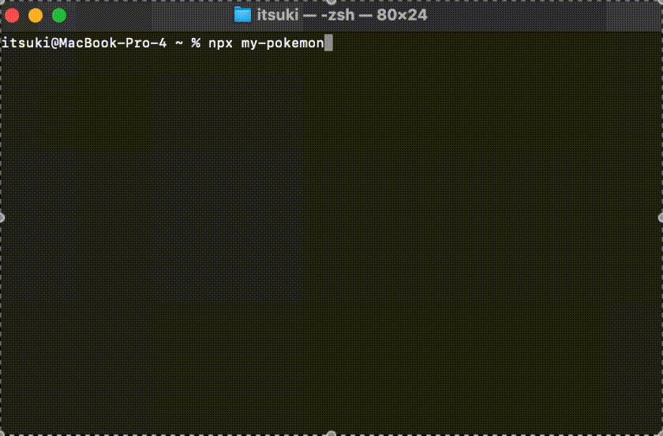

# Node.js CLI Demo (Typescript)

A simple Node.js CLI created using Typescript for demonstrating on how we can create and publish a Node.js CLI and executed it using npx.

For more details, please refer to [Create & Publish Node.js CLI (Typescript)]().